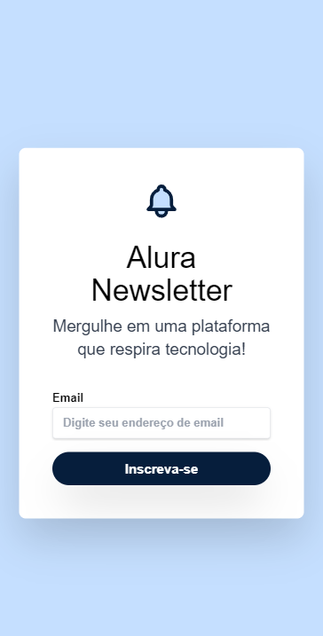

# Estudo do projeto Calmaria Spa da Alura

Seja bem-vindo(a) à apresentação do projeto Alura Newsletter, feito pelo time da Alura, a qual, através do instrutora Beatriz MOura, tive a oportunidade de assistir, codar, resumir e estar disponibilizando esse "Estudo de projeto" para você leitor.

<h2>Ferramentas utilizadas</h2>
<ul>
    <li><strong>Microsoft Visual Studio Code</strong>: esta foi a IDE que usamos para codificar.</li>
    <li><strong>Navegador web</strong>: o navegador é de sua preferência, mas sugerimos Google Chrome, Firefox ou Edge. É útil para inspecionar elementos "ao vivo".</li>
    <li><strong>Figma</strong>: recebemos o design do projeto através dessa ferramenta, onde podemos baixar arquivos, copiar medidas e propriedades, e entender a lógica do projeto. Recomendo aprender a usa-la.
    </li>
    <li><strong>Github</strong>: a ferramenta de versionamento de código foi o Github. Super rápido e fácil de entender.</li>
    <li><strong>Vercel</strong>: ferramenta utilizada para hospedar nosso site gratuitamente e compartilha-lo.</li>
</ul>

<h2>Organização de pastas</h2>

Esse projeto foi pequeno. Seria apenas uma página onde o usuário digitaria seu endereço de e-mail para insrever-se na Newsletter, logo, há apenas uma pasta.

<ul>
<li><strong>pasta-imagem</strong>: armazenamos nesta pasta a imagem do logo da Tailwind e um icone, apenas.</li>
<li><strong>index.html</strong>: arquivo html do projeto.</li>
<li><strong>readme.md</strong>: readme do projeto.</li>
</ul>

<h2>Passos para entregar esse projeto pronto</h2>
<ol>
    <li>Entender o design do projeto no Figma;</li>
    <li>Criar projeto no Github;</li>
    <li>Fazer download das imagens do projeto no Figma e criar e organizar pastas e arquivos;</li>
    <li>Acessar a <a href="https://tailwindcss.com/docs/installation/play-cdn">documentação do Tailwind</a>  e seguir passos de instalação "Play CDN".</li>
    <ul><li>Copie e cole dentro da tag "head": <pre><code>&ltscript src="https://cdn.tailwindcss.com"&gt&lt/script&gt</code></pre></li></ul>
    <li>Crie toda a estrutura do arquivo HTML, suas classes, conteúdo e diretório relativos das imagens.</li>
    <li>Comece a estilizar o projeto de acordo com Figma, começando pelo modelo mobile e por último o desktop ao torna-lo responsivo também.</li>
</ol>
<h2>Visualize o resultado final do projeto</h2>

Acesse o link do página: <a href="https://alura-newsletters-maciel.vercel.app">https://alura-newsletters-maciel.vercel.app</a>

<h2>Desafios e agradecimentos</h2>

Meu maior desafio foi entender a como a animação do sino funcionava. Consegui supera-lo ao práticar com os exercícios do curso.

Muito obrigado a você por ter lido até aqui. Muito obrigado Alura por ter fornecido um curso que foi entregue pela instrutora Beatriz, que álias me ajudou a entender o Tailwind, obrigado.

